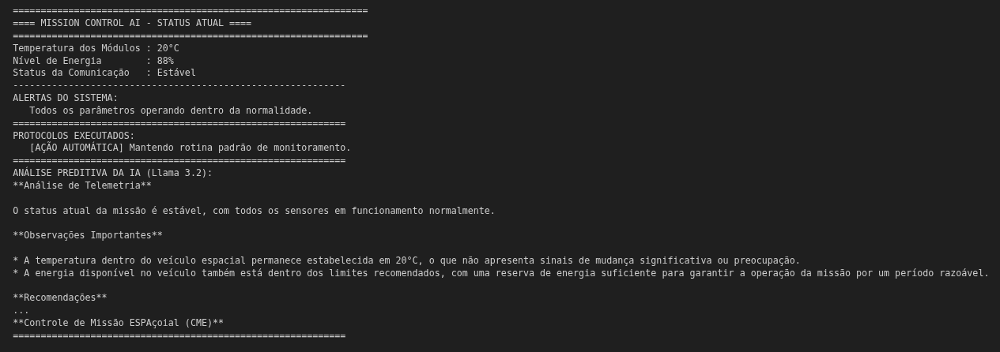
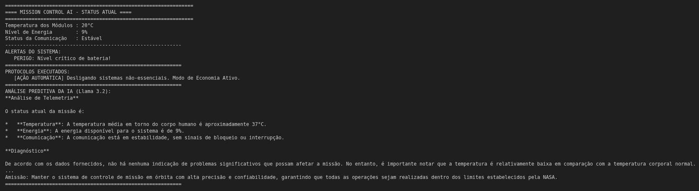

# Mission Control AI - Global Solution 2026.1

## O Que o Projeto Faz
Este é um sistema de monitoramento inteligente para controle operacional de uma missão espacial experimental desenvolvido em Python. O sistema simula dados de telemetria essenciais (temperatura, energia e comunicação), aplica lógica interna automatizada de tomada de decisão para contenção de danos e utiliza o modelo de linguagem Llama 3.2 1B (via Ollama) para gerar análises preditivas e relatórios críticos em tempo real.

## Tecnologias Utilizadas
* **Python 3** (Lógica principal e interface de terminal)
* **Ollama API** (Integração local do LLM)
* **Llama 3.2 1B** (Modelo de linguagem generativa para análise e previsão)
* **Google Colab** (Ambiente de desenvolvimento e execução)

---

## Demonstração (Prints do Sistema)

### 1. Sistema Operando em Condições Normais


### 2. Alerta Crítico e Resposta da IA


---

## Como Executar o Projeto

O projeto foi projetado para rodar 100% dentro do **Google Colab**, sem a necessidade de instalar dependências complexas na sua máquina local.

1. Acesse o nosso notebook através do link:
   [Acessar Notebook no Google Colab](https://colab.research.google.com/drive/1ZtH53DuKZOzaSRvUkqY_A3wwxwwPYOBT?usp=sharing)
2. Copie e execute como um arquivo pertencente a você
3. Certifique-se de executar as células na ordem correta. O script irá baixar, instalar e inicializar o servidor do **Ollama** e o modelo **Llama 3.2 1B** automaticamente em background.
4. Altere ou execute a célula de simulação para ver o sistema gerando os cenários operacionais, disparando os alertas lógicos e coletando a análise técnica da IA.

### Comandos executados caso for usar fora do Colab:
```bash
curl -fsSL [https://ollama.com/install.sh](https://ollama.com/install.sh) | sh

ollama serve &
ollama pull llama3.2:1b

pip install ollama
```

## Integrantes
| Nome                       | RM     |
| -------------------------- | ------ |
| Enzo Seiji Delgado Tabuchi | 573156 |
| Henrique Almeida Lucareli  | 569183 |
| Luca Almeida Lucareli      | 569061 |
